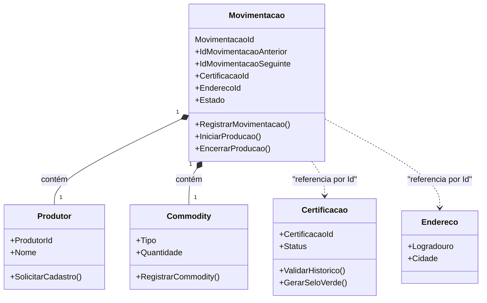

# 📚 Trabalho — Design Tático no DDD (Template para qualquer domínio)

> **Como usar:** copie este arquivo e substitua os **[colchetes]** com informações do **seu domínio** (e-commerce, marketplace, logística, educação, fintech, games, etc.).
> O objetivo é praticar Entidades, Value Objects, Agregados/AR, Repositórios e Eventos de Domínio — com foco em **invariantes** e **domínio rico**.

---

## 🚀 Quick start (5 passos)
1. Escolha um **domínio** que você conheça: AgroTrace.
2. Liste 3–7 **invariantes** que devem estar corretas no **commit**.
3. Escolha 1–2 **Agregados principais** (comece por **[Agregado Principal]**).
4. Desenhe a **máquina de estados** e os **eventos** que surgem das transições.
5. Defina o **Repositório** da AR e como lidará com **consistência** entre agregados.

---

## 🩺 1) Sobre o Domínio Escolhido
**Nome do domínio:** **AgroTrace**  
**Objetivo do sistema:** **Garantir a rastreabilidade de ponta a ponta de commodities agrícolas (soja, café, etc.), utilizando dados da cadeia de suprimentos para certificar a origem do produto e facilitar o acesso a crédito verde (green finance) para produtores rurais sustentáveis.**  
**Principais atores:** **[Lista: Produtor, Bureau de crédito, Financeiras, Órgãos Governamentais]**  
**Contextos (opcional):** **[Contexto de Produtores, Contexto de Rastreabilidade, Contexto de Certificação, Contexto de Acesso a crédito verde]**

---

## 🧩 2) Entidades vs Value Objects
Preencha a tabela justificando cada tipo (identidade vs. imutabilidade).

| Elemento | Tipo (Entidade/VO) | Por quê? (identidade/imutável) |
|---|---|---|
| **Produtor** | Entidade | Possui identidade única |
| **Endereço** | VO | Não é único por produtor |
| **Certificação** | Entidade | Única para cada produtor e possui regras específicas |
| **Commodity** | VO | Diferentes produtores podem produzir as mesmas commodities (café, trigo, açucar,e tc.) |
| **Financeira** | Entidade | Possui identidade única |

> Dica: Promova tipos semânticos: `Email`, `CPF/CNPJ`, `Money`, `IntervaloDeTempo`, `Endereco`, `Percentual`, `Quantidade`, etc. **VOs devem ser imutáveis** e com **igualdade por valor**.

---

## 🏗️ 3) Agregados e Aggregate Root (AR)
**Agregado Principal:** **Movimentação**  
**AR:** **Movimentação**  
**Conteúdo interno do agregado (apenas o necessário para consistência local):**
- **Produtor**
- **Commodity**

**Referências a outros agregados (por ID):**
- **Certificação** (não conter dentro do agregado)
- **Endereço**

**Boundary — Por que cada item está dentro/fora?**
- **Dentro porque toda movimentação envolve um produtor manipulando uma commodity**
- **Fora porque pode eventualmente alterar o status de uma movimentação e ocorre dentro de um dos endereços do produtor**

---

## 🧭 4) Invariantes e Máquina de Estados
Liste invariantes (devem ser verdadeiras ao final de cada transação).

**Invariantes:**
- **Não aceitar multiplas commodities em uma única movimentação**
- **Apenas produtores ativos podem realizar movimentações**

**Estados e transições da AR Movimentação:**
```
Plantação -> Colheita -> Processamento -> Armazenamento -> Distribuição
Regras:
- Plantação permitida se a commodity for cadastrada
- Colheito bloqueada se não houver registro de plantação
- Armazenamento exige que processamento atenda normas técnicas da NR-11
- Distribuição bloqueada se não atender as normas técnicas da NR-11
```

---

## 🗃️ 5) Repositório do Agregado (interface)
> Repositório trabalha **apenas com a AR**, sem expor entidades internas do agregado. Consultas analíticas ficam fora (read models).

**Linguagem livre** (ex.: C#, Java, Kotlin, TS). Exemplo (C# assíncrono, adapte nomes):
```csharp
public interface IMovimentacaoRepository
{
    Task<Movimentacao> ObterPorIdAsync(Guid id, CancellationToken ct = default);
    Task<List<Movimentacao>> ObterPorIdProdutorECommodityAsync(Guid idProdutor, Guid idCommodity, CancellationToken ct = default);
    Task AdicionarAsync(Movimentacao entidade, CancellationToken ct = default);
    Task SalvarAsync(Movimentacao entidade, CancellationToken ct = default);
}
```


---

## 📣 6) Eventos de Domínio
Defina **2–4 eventos** com **payload mínimo** e **momento de publicação** (preferir **pós-commit**). Diferencie **evento interno** vs **evento de integração**.

| Evento | Quando ocorre | Payload mínimo | Interno/Integração | Observações |
|---|---|---|---|---|
| **ProducaoIniciada** | Ao registrar commodity | id da commodity, id do produtor, tipo da commodity, descrição do preparo, data/hora da manipulação | Interno | Movimentação inicial não tem predecessora |
| **CommodityMovimentada** | Ao manipular a commodity em produção | id da commodity, id do produtor, tipo da commodity, descrição do evento, data/hora da manipulação, id movimentação anterior  | Interno | A movimentação anterior é atualizada com o id da nova movimentação para manter a sequencia valida |
| **ProducaoEncerrada** | Ao vender ou transferir produto colhido para terceiros | id da commodity, id do produtor, tipo da commodity, descrição do evento, data/hora da manipulação, id movimentação anterior | Interno | A movimentação anterior é atualizada com o id da nova movimentação para manter a sequencia valida e não possui sucessora |
| **MovimentacaoValidada** | Ao inserir ou atualizar alguma movimentação | Id do Produtor, Id da Commodity, Id da Movimentação | Integração | Se a sequencia de movimentações não inclui a nova movimentação, o certificado é invalidado |

---

## 🗺️ 8) Diagrama (Mermaid ou ferramenta à sua escolha)
> Mostre **Agregados/AR**, **VOs** e **relacionamentos por ID** entre agregados (não “contenha” outros agregados).

**Exemplo de esqueleto Mermaid:**


---

## ✅ Checklist de Aceitação
- [ ] **VOs imutáveis** e com **igualdade por valor** (nada de “string de CPF/Email”).
- [ ] **Boundary do agregado** pequeno e com **invariantes claras**.
- [ ] **Domínio rico**: operações do negócio como métodos (evitar `set` aberto).
- [ ] **Repositório** focado na **AR** (sem `IQueryable`/detalhes de ORM no domínio).


## 📤 Entrega

- **Inclua**: link/imagem do **diagrama** + todas as seções acima preenchidas.
---
