# Dinâmica: Design Estratégico do Projeto

## Objetivo

Identificar os subdomínios do projeto, classificá-los (Core, Supporting, Generic) e desenhar os bounded contexts,
incluindo suas interações. Esse exercício ajudará a criar uma visão clara e estratégica do domínio.

---

## 1. Nome do Projeto

AgroTrace

---

## 2. Objetivo Principal do Projeto

Garantir a rastreabilidade de ponta a ponta de commodities agrícolas (soja, café, etc.), utilizando dados da cadeia de
suprimentos para certificar a origem do produto e facilitar o acesso a crédito verde (green finance) para produtores
rurais sustentáveis.

---

## 3. Identificação dos Subdomínios

Liste os subdomínios do sistema e classifique-os como **Core Domain**, **Supporting Subdomain** ou **Generic Subdomain
**.

| **Subdomínio**                      | **Descrição**                                                                                            | **Tipo**    |
|-------------------------------------|----------------------------------------------------------------------------------------------------------|-------------|
| Certificação de sustentabilidade    | Avaliar movimentações das cadeias de suprimento de um produtor e emissão de selo de sustentabilidade     | Core Domain |
| Gestão de Produtores                | Cadastro, verificação e manutenção do histórico de produtores que buscam certificação para crédito verde | Core Domain |
| Rastreabilidade de commodities      | Manter registros de movimentações na cadeia de suprimentos dos produtores                                | Supporting  |
| Acesso ao crédito                   | Integrar produtores certificados com Fornecedores de Crédito.                                            | Supporting  |
| Integração com Bureaus de crédito   | Consulta scores e análises de crédito de Bureaus                                                         | Generic     |
| Integração com Dados Governamentais | Consulta Informações e certificações de orgãos do governo (IBAMA, Secr. Fazenda, Justiça)                | Generic     |

---

## 4. Desenho dos Bounded Contexts

Liste e descreva os bounded contexts identificados no projeto. Explique a responsabilidade de cada um.

| **Bounded Context**                | **Responsabilidade**                                                                          | **Subdomínios Relacionados**                                                                                                   |
|------------------------------------|-----------------------------------------------------------------------------------------------|--------------------------------------------------------------------------------------------------------------------------------|
| Contexto de Produtores             | Gerenciar o cadastro e histórico de produtores rurais                                         | Gestão de Produtores                                                                                                           |
| Contexto de Rastreabilidade        | Processa e controla registro de movimentação de commodities ao longo da cadeia de suprimentos | Rastreabilidade de commodities                                                                                                 |
| Contexto de Certificação           | Avalia histórico do produtor e de sua cadeia de suprimento para emitir certificados           | Certificação de sustentabilidade, Gestão de Produtores, Integração com Dados Governamentais, Integração com Bureaus de crédito |
| Contexto de Acesso a crédito verde | Para produtores certificados, integra com fornecedores de crédito                             | Certificação de sustentabilidade, Acesso ao crédito                                                                            |

---

## 5. Comunicação entre os Bounded Contexts

Explique como os bounded contexts vão se comunicar. Use os padrões de comunicação, como:

- **Mensageria/Eventos (desacoplado):** Ex.: O Contexto de Consultas emite um evento "Consulta Finalizada", consumido
  pelo Contexto de Pagamentos.
- **APIs (síncrono):** Ex.: O Contexto de Pagamentos consulta informações de preços no Contexto de Consultas.

| **De (Origem)**             | **Para (Destino)**                 | **Forma de Comunicação** | **Exemplo de Evento/Chamada**                            |
|-----------------------------|------------------------------------|--------------------------|----------------------------------------------------------|
| Contexto de Produtores      | Contexto de Rastreabilidade        | Mensageria (Evento)      | "Produtor cadastrado"                                    |
| Contexto de Rastreabilidade | Contexto de Certficação            | API                      | Obter informações de rastreabilidade pelo ID do produtor |
| Contexto de Certificação    | Contexto de Acesso a crédito verde | Mensageria (Evento)      | "Produtor certificado"                                   |

---

## 6. Definição da Linguagem Ubíqua

Liste os termos principais da Linguagem Ubíqua do projeto. Explique brevemente cada termo.

| **Termo**            | **Descrição**                                                                                    |
|----------------------|--------------------------------------------------------------------------------------------------|
| Produtor             | Agricultor ou cooperativa que produz commodities.                                                |
| Commodity            | Produto Agrícola rastreável (Ex. Soja, café, milho, algodão...).                                 |
| Rastreabilidade      | Sequência de movimentações de uma commodity do produtor até o destino final.                     |
| Movimentação         | Registro de armazenamento, processamento e/ou transporte de uma commodity.                       |
| Cadeia de suprimento | Conjunto de informações sobre produtores e movimentações das suas commodities.                   |
| Certificação         | Selo de sustentabilidade que valida boas práticas agrícolas de um Produtor.                      |
| Crédito Verde        | Financiamento oferecido a Produtores certificados.                                               |
| Bureau de crédito    | Fornecedor de informações e avaliações de crédito sobre um produtor (ex. Serasa, Boa Vista, SPC) |
| Histórico            | Registro sequencial das informações e certificações do Produtor.                                 |

---

## 7. Estratégia de Desenvolvimento

Para cada tipo de subdomínio, explique a abordagem para implementação:

- **Core Domain:** Desenvolver internamente com foco total.
- **Supporting Subdomain:** Desenvolver internamente ou parcialmente terceirizar.
- **Generic Subdomain:** Usar ferramentas ou serviços de mercado.

| **Subdomínio**                      | **Estratégia**                                      | **Ferramentas ou Serviços (se aplicável)** |
|-------------------------------------|-----------------------------------------------------|--------------------------------------------|
| Certificação de sustentabilidade    | Desenvolvimento interno                             |                                            |
| Gestão de Produtores                | Interno com uso de OAuth2 para login                | OAuth2                                     |
| Rastreabilidade de commodities      | Desenvolvimento interno                             |                                            |
| Acesso ao crédito                   | Terceirizar Desenvolvimento via fábrica de software |                                            |
| Integração com Bureaus de crédito   | Terceirizar usando API                              | Serasa, SPC, BoaVista                      |
| Integração com Dados Governamentais | Terceirizar usando API                              | QUOD                                       |

---

## 8. Diagrama Visual (Opcional, mas Recomendado)

Desenhe um diagrama que mostre:

- Os bounded contexts.
- Como eles se comunicam.
- A relação com os subdomínios.

Use ferramentas como **Miro**, **Lucidchart** ou mesmo papel e caneta para criar seu diagrama e adicionar ao projeto.

```mermaid
graph TD
    subgraph BC_PROD [Contexto de Produtores]
        direction TB
        SD_GP(Gestão de Produtores)
    end
    BC_PROD:::bcStyle

    subgraph BC_RAST [Contexto de Rastreabilidade]
        direction TB
        SD_Rast(Rastreabilidade de commodities)
    end
    BC_RAST:::bcStyle

    subgraph BC_CERT [Contexto de Certificação]
        direction TB
        SD_CERT_S(Certificação de sustentabilidade)
        SD_GP_C(Gestão de Produtores)
        SD_GOV(Integração com Dados Governamentais)
        SD_BC(Integração com Bureaus de crédito)
    end
    BC_CERT:::bcStyle
    
    subgraph BC_CRED [Contexto de Acesso a crédito verde]
        direction TB
        SD_CERT_A(Certificação de sustentabilidade)
        SD_ACRED(Acesso ao crédito)
    end
    BC_CRED:::bcStyle
    
    BC_PROD -->|Usa dados do Produtor| BC_RAST
    
    BC_PROD --o|Fornece Dados do Produtor| BC_CERT
    
    BC_RAST -->|Fornece Histórico da Cadeia| BC_CERT
    
    BC_CERT -->|Emite Certificado| BC_CRED

 
```

---

Boa sorte com a dinâmica! 🚀
